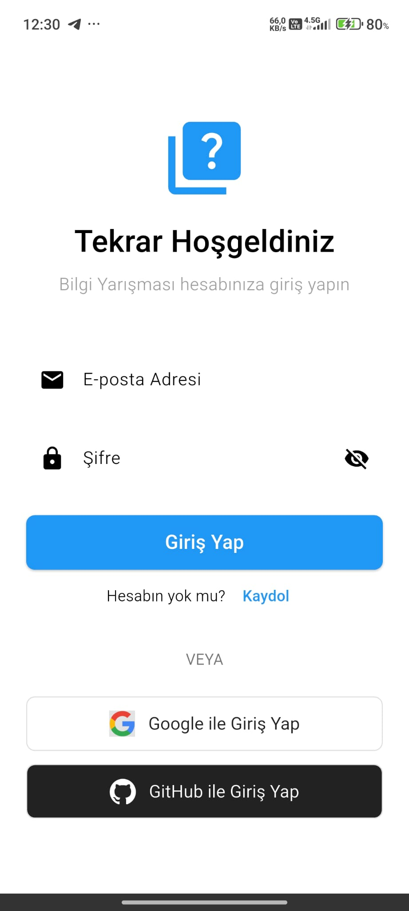
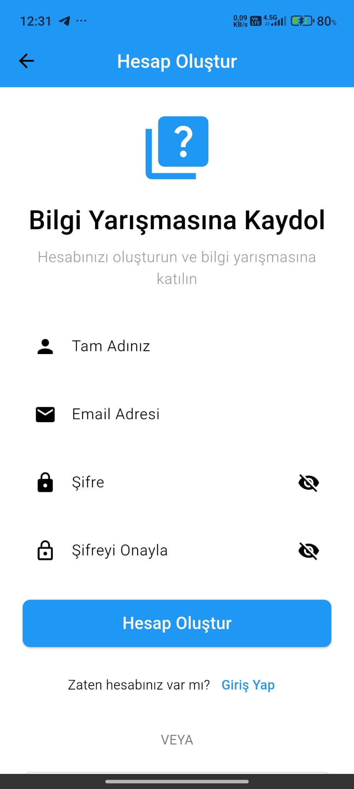
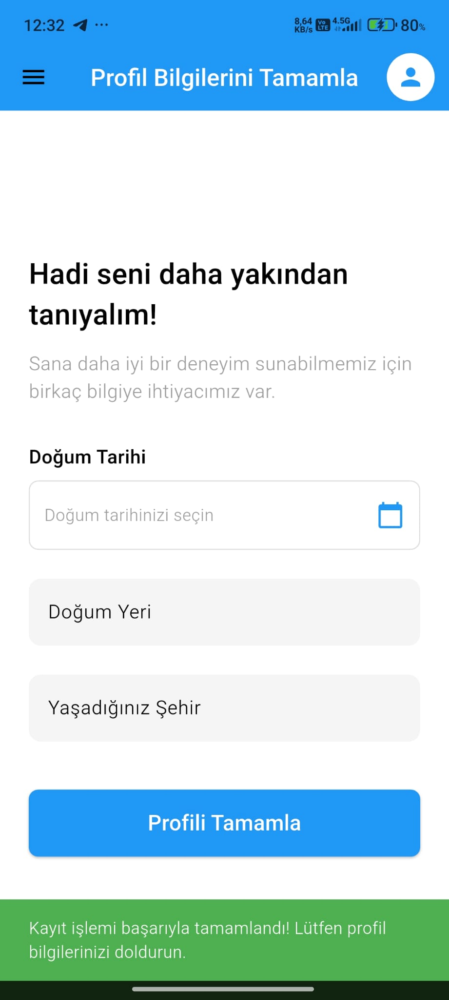
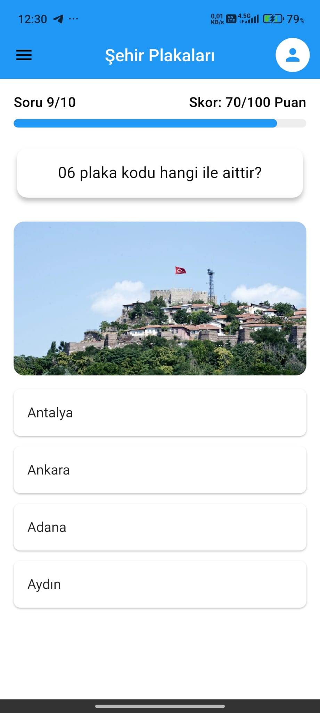
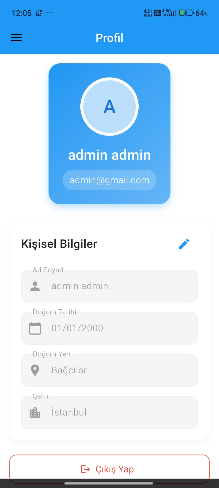
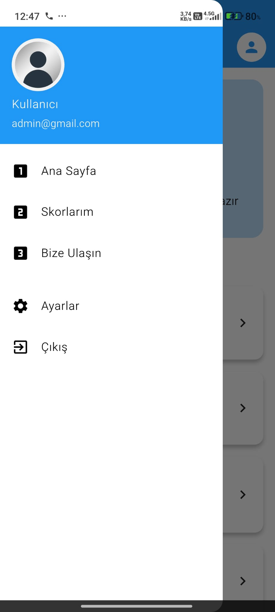
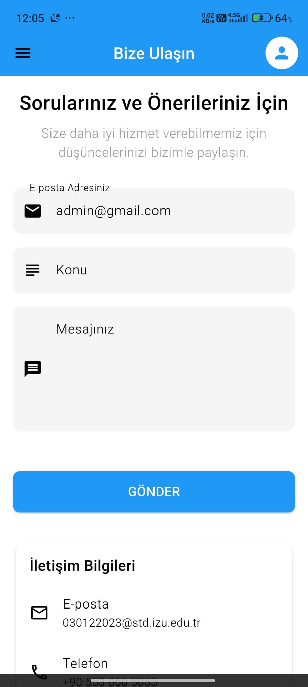
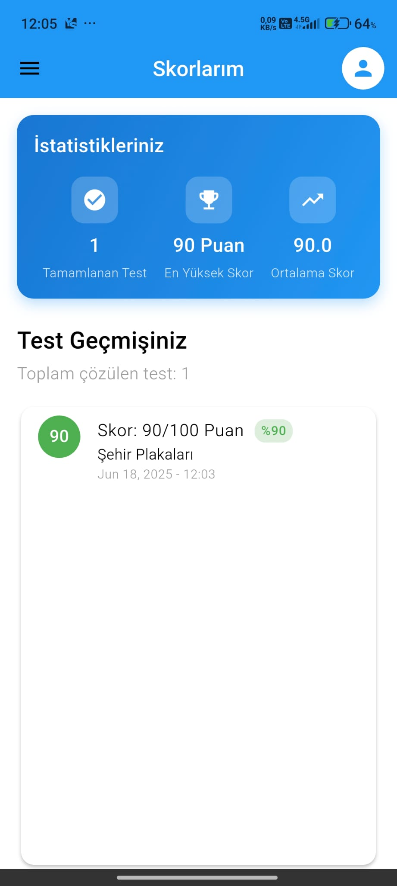

# Bilgi Yarışması Uygulaması

Bu uygulama, kullanıcıların bilgilerini test edebileceği, skorlarını takip edebileceği ve diğer kullanıcılarla rekabet edebileceği kapsamlı bir bilgi yarışması platformudur. Flutter framework'ü kullanılarak geliştirilmiş olup, modern bir kullanıcı arayüzü ve güçlü backend entegrasyonları sunmaktadır.

## 🔐 Admin Kullanıcı Bilgileri
```
Email: admin@gmail.com
Şifre: Admin123
```

## 🎯 Projenin Amacı
- Kullanıcılara eğlenceli ve eğitici bir quiz deneyimi sunmak
- Farklı kategorilerde bilgi seviyelerini test etme imkanı sağlamak
- Kullanıcılar arası rekabet ortamı oluşturmak
- Kişisel gelişimi takip etmeyi sağlamak

## Admin Kullanıcı Bilgileri
```
Email: admin@gmail.com
Şifre: Admin123
```

## 🔧 Teknik Altyapı

### Backend Servisleri

#### 🔥 Firebase
Firebase, uygulamanın kullanıcı yönetimi ve profil verilerinin saklanması için kullanılmaktadır.

**Kullanılan Servisler:**
- **Authentication:** 
  - Email/Password girişi
  - Google ile giriş
  - GitHub ile giriş
  
- **Firestore:**
  - Kullanıcı profil bilgileri
  - Tercihler ve ayarlar
  - Gerçek zamanlı veri senkronizasyonu

**Örnek Kullanıcı Dokümanı:**
```json
{
    "uid": "userUniqueId",
    "email": "user@example.com",
    "displayName": "Kullanıcı Adı",
    "photoURL": "https://...",
    "preferences": {
        "darkMode": true,
        "notifications": true
    },
    "stats": {
        "totalQuizzes": 25,
        "averageScore": 85
    }
}
```

#### ⚡ Supabase
Supabase, quiz içeriklerinin ve skor verilerinin yönetimi için kullanılmaktadır.

**Veritabanı Tabloları:**
- **questions:**
  ```sql
  CREATE TABLE questions (
    id UUID PRIMARY KEY,
    category_id UUID REFERENCES categories(id),
    question_text TEXT NOT NULL,
    options JSONB NOT NULL,
    correct_answer INTEGER NOT NULL,
    difficulty_level INTEGER,
    created_at TIMESTAMP DEFAULT NOW()
  );
  ```

- **categories:**
  ```sql
  CREATE TABLE categories (
    id UUID PRIMARY KEY,
    name VARCHAR(100) NOT NULL,
    description TEXT,
    icon_name VARCHAR(50)
  );
  ```

- **scores:**
  ```sql
  CREATE TABLE scores (
    id UUID PRIMARY KEY,
    user_id TEXT NOT NULL,
    quiz_id UUID,
    score INTEGER NOT NULL,
    answers JSONB,
    duration INTEGER,
    created_at TIMESTAMP DEFAULT NOW()
  );
  ```

## 📱 Uygulama Sayfaları ve Özellikleri

### 1. Giriş Sayfası (Login Page)

#### 🔐 Kimlik Doğrulama Özellikleri
- Email/Şifre ile güvenli giriş
- Google OAuth2.0 entegrasyonu
- GitHub OAuth entegrasyonu
- Şifremi unuttum işlemi (Email reset)
- Form validasyonları

#### 🎨 UI Özellikleri
- Modern ve minimalist tasarım
- Animasyonlu giriş formu
- Platform uyumlu butonlar
- Hata mesajları gösterimi
- Loading state yönetimi

#### 💻 Teknik Detaylar
```dart
final _auth = FirebaseAuth.instance;

Future<UserCredential> signInWithEmail(String email, String password) async {
  try {
    return await _auth.signInWithEmailAndPassword(
      email: email,
      password: password
    );
  } catch (e) {
    throw AuthException(e.toString());
  }
}
```


*Resim eklemek için: Bu klasörde `docs/images` dizini oluşturun ve login_page.png dosyasını buraya yerleştirin.*

### 2. Kayıt Sayfası (Sign Up Page)

#### 📝 Kayıt İşlemleri
- Email/Şifre validasyonu
  - Güçlü şifre kontrolü
  - Email format kontrolü
- Google hesabı ile hızlı kayıt
- GitHub hesabı ile hızlı kayıt
- Benzersiz kullanıcı adı kontrolü

#### 🔒 Güvenlik Özellikleri
- Şifre karmaşıklık kontrolü
- CAPTCHA entegrasyonu
- Email doğrulama zorunluluğu
- Rate limiting

#### 🎯 İş Mantığı
```dart
class SignUpValidators {
  static bool isPasswordStrong(String password) {
    return password.length >= 8 &&
           password.contains(RegExp(r'[A-Z]')) &&
           password.contains(RegExp(r'[0-9]')) &&
           password.contains(RegExp(r'[!@#$%^&*(),.?":{}|<>]'));
  }
  
  static Future<bool> isEmailAvailable(String email) async {
    // Firebase email check implementation
  }
}



### 3. Profil Tamamlama Sayfası (Complete Profile Page)

#### 👤 Profil Bilgileri
- Kullanıcı adı seçimi
- Doğum tarihi (DatePicker widget)
- Şehir seçimi (Dropdown widget)
- Profil fotoğrafı yükleme
- İlgi alanları seçimi

#### 🔄 Veri Yönetimi
```dart
class UserProfile {
  final String uid;
  final String username;
  final DateTime birthDate;
  final String city;
  final String photoUrl;
  final List<String> interests;
  
  // Firestore serialization
  Map<String, dynamic> toJson() => {
    'uid': uid,
    'username': username,
    'birthDate': birthDate.toIso8601String(),
    'city': city,
    'photoUrl': photoUrl,
    'interests': interests
  };
}
```

#### 📊 Form Yönetimi
- Form validation
- Image cropping ve compression
- Otomatik kaydetme
- Progress tracking



### 4. Ana Sayfa (Home Page)

#### 🎮 Oyun Özellikleri
- Kategori bazlı quiz seçimi
- Zorluk seviyesi filtreleme
- Günlük challenge modu
- Arkadaş skorları

#### 📊 İstatistikler
- Toplam quiz sayısı
- Başarı yüzdesi
- Rozet sistemi
- Haftalık performans

#### 💾 Veri Yapısı
```dart
class QuizCategory {
  final String id;
  final String name;
  final String description;
  final String iconPath;
  final List<String> difficultyLevels;
  final int questionCount;
  
  Future<List<Question>> getQuestions(String difficulty) async {
    return await SupabaseClient
      .from('questions')
      .select()
      .eq('category_id', id)
      .eq('difficulty', difficulty)
      .execute();
  }
}


### 5. Quiz Sayfası (Quiz Page)

#### 🎯 Oyun Mekanikleri
- Zamanlı sorular (30 saniye/soru)
- Joker hakları
  - 50:50 seçeneği
  - Süre ekleme
  - Soru değiştirme
- Puanlama sistemi
  - Hız bonusu
  - Doğruluk çarpanı
  - Streak bonusu

#### 🎨 UI/UX Özellikleri
- Animasyonlu soru geçişleri
- Progress bar
- Gerçek zamanlı geri sayım
- Sesli geri bildirimler
- Haptic feedback

#### 💻 Teknik Detaylar
```dart
class QuizController extends GetxController {
  final RxInt currentScore = 0.obs;
  final RxInt currentQuestion = 0.obs;
  final RxBool isLoading = false.obs;
  final RxDouble timeRemaining = 30.0.obs;
  
  double calculateScore(int timeSpent, bool isCorrect) {
    if (!isCorrect) return 0;
    
    // Baz puan: 100
    // Hız bonusu: Kalan süre * 3.33
    return 100 + (timeRemaining.value * 3.33);
  }
  
  // Joker kullanım mantığı
  void useFiftyFifty(List<String> options) {
    // İki yanlış şıkkı kaldır
  }
}



### 6. Profil Sayfası (Profile Page)

#### 👤 Profil Yönetimi
- Avatar/profil fotoğrafı
  - Kamera ile çekim
  - Galeriden seçim
  - Crop ve düzenleme
- Kişisel bilgi yönetimi
  - İsim ve kullanıcı adı
  - Email değiştirme
  - Şifre güncelleme
- Tercihler
  - Bildirim ayarları
  - Tema seçimi
  - Dil seçimi

#### 📊 İstatistikler ve Başarılar
- Quiz istatistikleri
  - Tamamlanan quiz sayısı
  - Ortalama skor
  - En yüksek skor
  - Kategori bazlı performans
- Başarı rozetleri
  - Bronze/Silver/Gold rozetler
  - Özel başarı rozetleri
- Seviye sistemi
  - XP puanları
  - Seviye ilerlemesi

#### 💾 Veri Modeli
```dart
class UserStats {
  final int totalQuizzes;
  final double averageScore;
  final Map<String, int> categoryScores;
  final List<Achievement> achievements;
  final int level;
  final int xp;
  
  double calculateProgress() {
    return (xp % 1000) / 1000; // Her 1000 XP'de level atlama
  }
  
  Future<void> updateStats(QuizResult result) async {
    // Firebase ve Supabase güncelleme
  }
}



### 7. Drawer Menü

#### 🎨 UI Bileşenleri
- Kullanıcı profil özeti
  - Profil fotoğrafı
  - Kullanıcı adı
  - E-posta adresi
- Sayfa navigasyonları
  - Sayfa 1 (Quiz Kategorileri)
  - Sayfa 2 (Skor Tablosu)
  - Sayfa 3 (Profil)
  - Ayarlar
  - Çıkış
  
#### 💻 Teknik Özellikler
```dart
class DrawerWidget extends StatelessWidget {
  final User user;
  final ThemeController themeController;
  
  Widget build(BuildContext context) {
    return Drawer(
      child: ListView(
        children: [
          UserAccountsDrawerHeader(
            currentAccountPicture: CircleAvatar(...),
            accountName: Text(user.displayName),
            accountEmail: Text(user.email),
          ),
          ListTile(
            leading: Icon(Icons.quiz),
            title: Text('Sayfa 1'),
            onTap: () => Navigator.pushNamed(context, '/page1'),
          ),
          // Diğer sayfalar için ListTile'lar
        ],
      ),
    );
  }
}
```


*Kullanıcı dostu ve işlevsel drawer menü*

### 8. Bize Ulaşın Sayfası

#### 📧 İletişim Formu Özellikleri
- E-posta adresi girişi
- Konu seçimi
- Mesaj alanı
- Form validasyonu
- Gönderme durumu bildirimleri

#### 🔧 Teknik Yapı
```dart
class ContactForm {
  final String email;
  final String subject;
  final String message;
  
  Future<void> submit() async {
    try {
      await FirebaseFunctions.instance
        .httpsCallable('sendContactForm')
        .call({
          'email': email,
          'subject': subject,
          'message': message,
        });
    } catch (e) {
      throw ContactFormException(e.toString());
    }
  }
}
```

#### 🎨 UI/UX Özellikleri
- Material Design form elemanları
- Gerçek zamanlı validasyon
- Yükleme göstergesi
- Başarı/hata mesajları
- Responsive tasarım


*Kullanıcı dostu iletişim formu*

### 9. Skorlar Sayfası (Scores Page)

#### 🏆 Sıralama Sistemi
- Global sıralama
  - Haftalık liderler
  - Aylık liderler
  - Tüm zamanların en iyileri
- Kategori bazlı sıralamalar
- Arkadaş sıralaması
- Ülke/Bölge sıralaması

#### 📈 Detaylı İstatistikler
- Zaman bazlı analiz
  - Günlük performans
  - Haftalık trend
  - Aylık gelişim
- Kategori analizi
  - En iyi/en kötü kategoriler
  - Gelişim alanları
  - Kategori bazlı öneriler

#### 🔄 Gerçek Zamanlı Güncelleme
```dart
class LeaderboardController extends GetxController {
  final _supabase = Supabase.instance.client;
  final RxList<LeaderboardEntry> entries = <LeaderboardEntry>[].obs;
  
  @override
  void onInit() {
    super.onInit();
    // Realtime subscription
    _supabase
      .from('scores')
      .stream(primaryKey: ['id'])
      .order('score', ascending: false)
      .limit(100)
      .execute()
      .listen((data) {
        // Update leaderboard
        entries.value = data.map((e) => LeaderboardEntry.fromJson(e)).toList();
      });
  }
  
  Future<void> refreshScores() async {
    // Manual refresh implementation
  }
}



## 📸 Ekran Görüntüleri

Bu bölümde uygulamanın her sayfasından ekran görüntüleri ekleyebilirsiniz. Ekran görüntülerini eklemek için:

1. `docs/images` klasörü oluşturun:
```bash
mkdir -p docs/images
```

2. Ekran görüntülerini aşağıdaki isimlerle kaydedin:
```
docs/images/
├── login.png        # Giriş sayfası
├── signup.png       # Kayıt sayfası
├── profile.png      # Profil sayfası
├── quiz.png        # Quiz sayfası
├── scores.png      # Skor sayfası
├── leaderboard.png # Liderlik tablosu
├── settings.png    # Ayarlar sayfası
├── drawer.png      # Drawer menü
└── contact.png     # Bize ulaşın sayfası
```

3. Her ekran görüntüsünü README'ye ekleyin:

#### 🔐 Giriş Sayfası

*Modern ve kullanıcı dostu giriş arayüzü*

#### 📝 Kayıt Sayfası

*Kolay ve güvenli kayıt süreci*

(Diğer sayfalar için aynı şekilde devam edin)

## 🔧 Geliştirici Kılavuzu

### 📋 Ön Gereksinimler
- Flutter SDK (stable channel)
- Dart SDK
- VS Code veya Android Studio
- Git
- Node.js (Firebase araçları için)

### 🚀 Kurulum Adımları
1. Repo'yu klonlayın:
```bash
git clone https://github.com/username/quiz-app.git
cd quiz-app
```

2. Bağımlılıkları yükleyin:
```bash
flutter pub get
```

3. Firebase CLI yükleyin ve yapılandırın:
```bash
npm install -g firebase-tools
firebase login
firebase init
```

4. Supabase projesini kurun:
- Supabase Console'dan yeni proje oluşturun
- Verilen API anahtarlarını `lib/constants.dart` dosyasına ekleyin
- SQL şemalarını import edin

### 📚 Proje Yapısı
```
lib/
├── main.dart           # Uygulama girişi
├── constants/          # Sabit değerler
├── models/            # Veri modelleri
├── services/          # API servisleri
├── controllers/       # İş mantığı
├── views/            # UI sayfaları
├── widgets/          # Yeniden kullanılabilir widget'lar
└── utils/            # Yardımcı fonksiyonlar
```

### 🔨 Build ve Release
```bash
# Android için APK build
flutter build apk --release

# iOS için
flutter build ios --release

# Web için
flutter build web --release

## 🤝 Katkıda Bulunma

1. Fork'layın
2. Feature branch oluşturun
3. Değişikliklerinizi commit'leyin
4. Branch'inizi push edin
5. Pull Request açın

## 📝 Test Süreci

### Unit Tests
```bash
flutter test test/unit/
```

### Widget Tests
```bash
flutter test test/widget/
```

### Integration Tests
```bash
flutter test integration_test/
```

## 📱 Desteklenen Platformlar

- ✅ Android 5.0+
- ✅ iOS 11.0+
- ✅ Web (Chrome, Firefox, Safari)
- ✅ Windows
- ✅ macOS
- ✅ Linux

## 📄 Lisans

Bu proje MIT lisansı altında lisanslanmıştır - detaylar için [LICENSE](LICENSE) dosyasına bakınız.

## 📞 İletişim

Proje sorumlusu: [Ad Soyad]
E-posta: [E-posta adresi]

## 🙏 Teşekkürler

- Flutter ekibine
- Firebase ekibine
- Supabase ekibine
- Tüm katkıda bulunanlara
