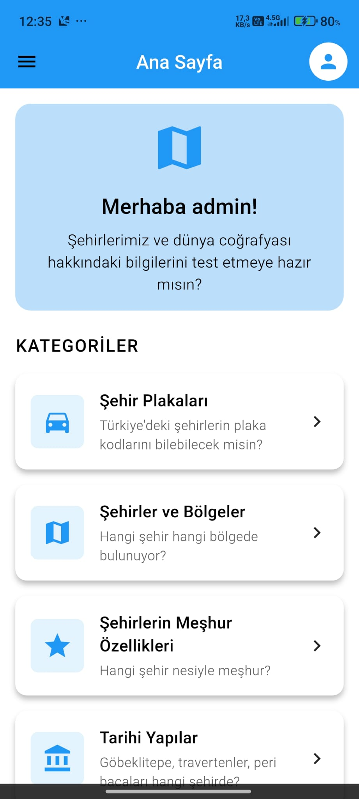

# Quiz App - Flutter

Bu uygulama, kullanıcıların çeşitli kategorilerde quiz sorularını yanıtlayabildiği, skorlarını takip edebildiği ve profil bilgilerini yönetebildiği bir Flutter uygulamasıdır.

## Admin Kullanıcı Bilgileri
```
Email: admin@gmail.com
Şifre: Admin123
```

## Veri Yönetimi

### Firebase
- Kullanıcı kimlik doğrulaması (Email/Password, Google ve GitHub sign-in)
- Kullanıcı profil bilgilerinin Firestore'da saklanması
- Gerçek zamanlı veri senkronizasyonu

### Supabase
- Quiz soruları ve kategorileri
- Kullanıcı skorları
- Skor istatistikleri ve sıralamalar

## Sayfalar ve Özellikler

### 1. Giriş Sayfası (Login Page)
- Email/Şifre ile giriş
- Google ile giriş
- GitHub ile giriş
- Şifremi unuttum fonksiyonu
- Yeni hesap oluşturma seçeneği


*Resim eklemek için: Bu klasörde `docs/images` dizini oluşturun ve login_page.png dosyasını buraya yerleştirin.*

### 2. Kayıt Sayfası (Sign Up Page)
- Email/Şifre ile kayıt
- Google ile kayıt
- GitHub ile kayıt
- Temel bilgi validasyonu


### 3. Profil Tamamlama Sayfası (Complete Profile Page)
- Kullanıcı adı
- Doğum tarihi seçimi
- Doğum yeri
- Şehir bilgisi
- Form validasyonu


### 4. Ana Sayfa (Home Page)
- Quiz kategorileri listesi
- Kategori bazlı filtreleme
- Kullanıcı karşılama mesajı
- Skor görüntüleme kısayolu



### 5. Quiz Sayfası (Quiz Page)
#### Teknik Özellikler:
- Dinamik soru yükleme
- Kategori bazlı soru filtreleme
- Skor hesaplama
- Zamanında doğru/yanlış gösterimi
- Progress tracking

#### İşlevsel Özellikler:
- Her soruda 4 seçenek
- Anlık doğru/yanlış gösterimi
- Quiz sonu skor özeti
- Quiz tekrar başlatma seçeneği


### 6. Profil Sayfası (Profile Page)
#### Teknik Özellikler:
- Firestore ile profil bilgisi senkronizasyonu
- Offline veri desteği (SQLite)
- Form validasyonu
- Resim yükleme ve önizleme

#### İşlevsel Özellikler:
- Profil bilgilerini düzenleme
- Profil fotoğrafı güncelleme
- Kullanıcı istatistikleri görüntüleme
- Çıkış yapma


### 7. Skorlar Sayfası (Scores Page)
#### Teknik Özellikler:
- Supabase gerçek zamanlı skor takibi
- Skor filtreleme ve sıralama
- İstatistik hesaplama
- Kategoriye göre performans analizi

#### İşlevsel Özellikler:
- Toplam quiz sayısı
- En yüksek skor
- Ortalama skor
- Kategori bazlı başarı oranları


## Resim Ekleme Kılavuzu

1. Projenin kök dizininde `docs/images` klasörü oluşturun:
```bash
mkdir -p docs/images
```

2. Ekran görüntülerinizi bu klasöre şu isimlerle kaydedin:
- login_page.png
- signup_page.png
- complete_profile_page.png
- home_page.png
- quiz_page.png
- profile_page.png
- scores_page.png

3. README.md dosyasında zaten hazır olan resim etiketleri otomatik olarak bu resimleri gösterecektir.

## Teknik Detaylar

### Firebase Yapılandırması
- Authentication: Email/Password, Google, GitHub providers
- Firestore Collections:
  - users: Kullanıcı profil bilgileri
  - settings: Uygulama ayarları

### Supabase Yapılandırması
- Tables:
  - questions: Quiz soruları ve cevapları
  - categories: Quiz kategorileri
  - scores: Kullanıcı skorları
  - user_stats: Kullanıcı istatistikleri

### Veri Şemaları

#### Firestore User Document
```json
{
  "uid": "string",
  "email": "string",
  "displayName": "string",
  "birthDate": "string",
  "birthPlace": "string",
  "city": "string",
  "photoURL": "string"
}
```

#### Supabase Score Table
```sql
CREATE TABLE scores (
  id SERIAL PRIMARY KEY,
  user_id TEXT NOT NULL,
  score INTEGER NOT NULL,
  category_id TEXT,
  category_name TEXT,
  total_questions INTEGER DEFAULT 10,
  score_percent INTEGER,
  created_at TIMESTAMP DEFAULT NOW()
);
```

## Yerel Geliştirme

1. Flutter SDK'yı yükleyin
2. Gerekli bağımlılıkları yükleyin:
```bash
flutter pub get
```
3. Firebase ve Supabase konfigürasyonlarını yapın
4. Uygulamayı çalıştırın:
```bash
flutter run
```
